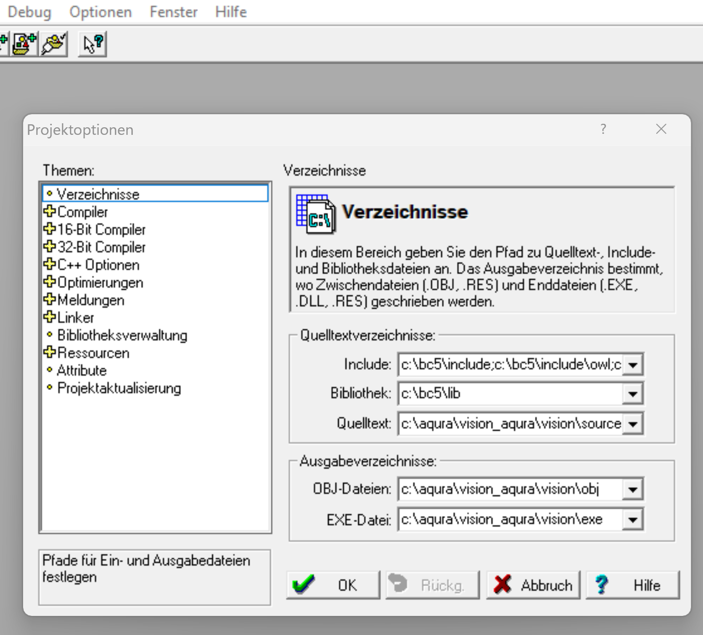

**Overview**

&nbsp;

Vision is an old, but functional and simple, data acquisition system that is directly compatible with OpticsFoundry's control software [Optics_Foundry_Control_AQuRA](https://github.com/opticsfoundry/OpticsFoundry_Control_AQuRA).

** Vision **

An old, but simple data acquisition and analysis software, directly compatible with OpticsFoundry_Control, written using Borland C++ 5.02.

Use one of the CameraServer programs to transmit camera data to Vision. 

Adjust the file Vision\Vision.cfg to your configuration, e.g. camera server IP addresses and ports, window sizes, filenames, etc. 

After cloning, open Vision\Vision.ide.
 
Adjust paths in "Optionen -> Projekt".

Do "Projekt -> Projekt neu compilieren"
 
If error "can't read resource file", quit Borland and load Vision.ide again, and Do "Projekt -> Projekt neu compilieren" again.
 
Execute Vision by "Debug -> Ausführen"
